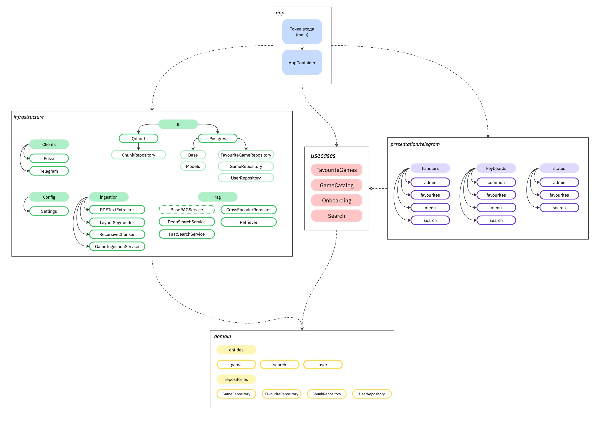

# Design-Doc: Чат-бот по настольным играм

## 1. Контекст проекта

### 1.1 Бизнес-задача
- Настольные игры являются популярным досугом в России и не только. Они различаются по видам, сложности, темам и т.д.. У каждой игры так или иначе есть правила. Часто в процессе игры у участников могут возникать вопросы насчёт правил. На то, чтобы найти ответ в бумажной версии правил, которая обычно идет в комплекте с игрой, может тратиться очень много времени.

- Хотелось бы иметь решение, которое помогло бы игрокам быстро решить вопрос и не отвлекаться от процесса игры. В связи с этим нашей целью является предоставление ответов на вопросы по правилам настольных игр для **улучшения игрового опыта** и **экономии времени**

- Для решения данной проблемы подходит **чат-бот на основе RAG-системы**, так как у нас есть структурированные текстовые документы (правила настольных игр), на которых RAG будет хорошо работать, выдавая релевантные фрагменты из правил. Использование RAG уменьшает риск "галлюцинаций" LLM при генерации ответов, так как они будут основываться на реальных правилах от официального источника.

- **Критериями успеха** в данном проекте можно считать востребованность среди пользователей и их удовлетворенность

		- Объективный критерий: возврат пользователей (Retention Rate)

		- Субъективный критерий: отзывы пользователей (например, после одной сессии вопрос-ответ, задаем вопрос, полезен ли был для пользователя ответ, таким образом можем посчитать долю хорошо оцененных пользователями ответов)

### 1.2 Целевая аудитория и пользователи
- **ЦА бота** - это любители настольных игр, люди разных возрастов от подростков до взрослых 30-40 лет. 

- Так как мы предполагаем, что вопрос задается во время партии, то важно, чтобы сценарий использования должен быть максимально **простым и интуитивным**, чтобы быстро получить ответ на вопрос и продолжить игру:
        
    Выбрал игру -> Задал вопрос -> Получил ответ

Таким образом, предлагается проводить взаимодействие в мессенджере Telegram, так как это наиболее подходящий вариант для нашего случая: низкий порог входа для использований и привычный интерфейс, следовательно не требуется дополнительного времени на то, чтобы разобраться, что и как работает. Оставшаяся задача - сделать путь пользователя так же максимально простым. 

#### Сценарии использования

- Любимые игры: пользователь может добавить в свой аккаунт любимые игры. Для этого он нажимает соответствующую кнопку, вводит название игры, ему выпадают наиболее релевантные, похожие игры по названию, которое он ввел (из тех игр, которые есть в базе), и он выбирает из них. Это сделано для того, чтобы, во-первых, облегчить пользование (пользователю не нужно каждый раз в запросе писать название игры, если он хочет задать вопрос, то он сначала выбирает любимую игру путем нажатия кнопки, потом пишет запрос), во-вторых, улучшить/ускорить работу чат-бота, так как мы ищем не по всем файлам, а только по тем, которые относятся к этой игре и ее версиям/дополнениям. Пользователь так же может удалить игру из списка любимых, если например ошибся или эта игра больше не актуальна.

- Задать вопрос: пользователь выбирает игру из списка любимых, пишет текстовый запрос, бот его обрабатывает (хочется сделать так, чтобы пользователь понимал на какой стадии находится бот, то есть мы выводим какие-то промежуточные сообщения по мере подготовки ответа, например, "ищу информацию" - "подготавливаю ответ" и т.д., чтобы пользователю не казалось, что его запрос не увидели или что-то сломалось, если запрос будет обрабатываться небыстро). Далее пользователь получает ответ на вопрос и может оценить то, насколько он ему помог так же путем нажатия кнопок. 

- Основная нагрузка будет приходиться на **вечер пятницы** и **выходные дни**. 

### 1.3 Ограничения и допущения

#### 1.3.1 Границы
- **Главная задача бота** — разрешение неоднозначных ситуаций в правилах настольных игр. Он должен давать аргументированный ответ на основе официальных правил.

- Бот не должен отвечать на вопросы вне предметной области.

- Бот не должен давать субъективные оценки и рекомендации по тому, как нужно играть.

#### 1.3.2 Риски
- Генерация неверного ответа, который испортит игру и вызовет недоверие у пользователя.

- Генерация грубого или нерелевантного ответа, который не имеет отношения к вопросу.

- Нарушение авторских прав издателей игр.

#### 1.3.3 Ограничения и предположения о структуре проекта
- Основным источником данных являются текстовые PDF-файлы с официальными правилами настольных игр, дополнений или FAQ. Бот работает только с теми играми, для которых доступны правила, переведённые на русский язык.

- Предполагается, что PDF-файлы содержат машинно-читаемый текст. Документы без текстового слоя не обрабатываются.

- Так как используемые документы (то есть правила настольных игр) являются общедоступными и не содержат персональных или конфиденциальных данных, допускается использование внешней LLM для обработки текстов и формирования ответов без нарушения требований безопасности.

- Бот формирует ответы исключительно на основе официальных правил и не использует неофициальные источники, такие как форумы или устные договоренности игроков.

- Предполагается, что правила настольных игр обновляются относительно редко. В большинстве случаев изменения правил связаны с выпуском новой версии или редакции игры, а не с правками существующего документа. 
В связи с этим обновление базы данных правил осуществляется эпизодически и не требует автоматической синхронизации.

## 2. Архитектура решения

### 2.1 Общая схема

**Диаграмма зависимостей в проекте**

**Диаграмма архитектуры (порядок, откуда и куда стучимся)**
1. Запрос пользователя

	Пользователь → `Telegram Bot API` → `handler` → `SearchUseCase`
	→ `FastSearchService / DeepSearchService` → `Retriever` → `PolzaEmbeddingClient`
	→ `QdrantChunkRepository` → `CrossEncoderReranker` → `PolzaLLMClient`
	→ `handlers` → Пользователь

2. Добавление игры через админа

	Администратор → `Telegram Bot API` → `admin handler` → `GameIngestionService` → `PdfTextExtractor` → `LayoutSegmenter` → `RecursiveChunker` → `PolzaEmbeddingClient` → `QdrantChunkRepository` → `Postgres repositories` → `admin handler` → Администратор

**Основные компоненты и их роли**

- `app` — точка входа приложения и сборка всех зависимостей через контейнер.
- `presentation/telegram` — слой взаимодействия с пользователем: обработчики сообщений, клавиатуры и состояния диалога.
- `usecases` — бизнесовая логика сценариев: поиск, онбординг, работа с любимыми играми, админские действия.
- `domain` — базовые сущности и интерфейсы репозиториев, не зависящие от внешних технологий.
- `infrastructure` — технический слой, в котором находятся интеграции с базами данных, внешними API, RAG-сервисами и пайплайном индексации.

### 2.2 Хранилище знаний / документооборот

- В качестве источника знаний используются официальные PDF-файлы с правилами настольных игр, правилами дополнений, а также официальные FAQ (вопросы-ответы) на русском языке. Исходные документы хранятся локально в файловом хранилище проекта, а после обработки в системе сохраняются текстовые чанки правил, их embedding-векторы и метаданные. Векторное представление чанков и данные, необходимые для retrieval, хранятся в Qdrant.

- Перед загрузкой в базу документы проходят пайплайн предобработки: парсинг PDF, очистку текста от служебных элементов и дубликатов, восстановление порядка чтения, сегментацию на блоки и последующее чанкирование. В качестве основных метаданных используются название серии игр, название файла/дополнения/версии, краткое описание, год и технические параметры чанка.

		Это сделано для того, чтобы при поиске по серии игр, учитывались все файлы, которые есть по этой игре

- Обновление базы выполняется по мере необходимости, при добавлении новой игры или новой редакции правил. Для этого новый PDF-файл вручную добавляется в хранилище через админа в телеграме (админ просто загружает файл и прописывает метаданные), после чего автоматически проходит тот же пайплайн парсинга, предобработки, чанкинга, векторизации и загрузки в Qdrant. Поскольку правила настольных игр обновляются редко, синхронизация в реальном времени не требуется.

### 2.3 Retrieval + Generation

Для retrieval используется Qdrant. В качестве embedding-модели выбрана `google/gemini-embedding-001`, а основная стратегия сегментации — рекурсивный чанкинг с размером чанка 512 токенов. Поиск выполняется по чанкам правил с фильтрацией по названию игры.

Для генерации ответа используется модель `qwen/qwen3-next-80b-a3b-instruct`, подключаемая через внешнее API Polza.

Глобально есть 2 сценария для RAG: `Fast Search` и `Deep Search`

- `Fast Search` использует обычный retrieval и при необходимости делает один дополнительный шаг уточнения, после чего выполняется финальный реранк
- `Deep Search` предназначен для сложных вопросов: в этом режиме модель сначала декомпозирует вопрос, затем выполняет многошаговый retrieval по нескольким подзапросам и только после этого реранжирует в финальной генерации.

### 2.4 Интеграции и интерфейсы
- В системе используются Telegram Bot API как чат-интерфейс, Polza API для embedding-модели и генерации ответов, локальные Postgres для хранения пользователей и игровых данных, а также Qdrant для retrieval по векторной базе правил.

- Взаимодействие с Telegram и внешним LLM API реализовано по HTTP API. Бот работает в режиме polling

- По UI/UX Пользователь взаимодействует с ботом через Telegram-чат. Нового пользователя ждет краткий онбординг, далее пользователь сможет управлять любимыми играми (добавлять/удалять), задавать вопросы либо в Fast Search, либо в Deep Search, а также есть отдельный админский сценарий загрузки PDF с правилами. Все сценарии реализованы максимально удобно, чтобы пользователю не приходилось миллион раз писать одно и то же: используются inline-кнопки, reply-клавиатуры и т.д.

- В текущей версии реализовано базовое логирование работы приложения и ошибок, включая ошибки обращения к внешнему API. Аналитики пользовательских сценариев и системы алертов нет.

### 2.5 Инфраструктура и развертывание
- Система разворачивается в Docker: отдельно поднимаются контейнеры для Telegram-бота, Postgres и Qdrant.

- В проекте предусмотрена локальная среда разработки и конфигурация для развёртывания на сервере через docker-compose

- Основной пайплайн может работать на CPU, так как самые энергозатратные блоки (эмбеддеры, LLM) вынесены на внешние API. Однако локальный реранкер и обработка PDF могли бы работать быстрее при наличии более мощных вычислительных ресурсов. Также требуется дисковое пространство для хранения PDF, Postgres и Qdrant.

- Токены и API-ключи, вынесены в .env и не хранятся в коде. Разграничение доступа реализовано через список admin Telegram ID, что ограничивает загрузку новых файлов только доверенным пользователям.

## 3. Данные и качество знаний

### 3.1 Сбор и предобработка данных

#### 3.1.1 Источники документов
- В качестве источника правил используются общедоступные PDF-файлы, 
размещённые на официальных сайтах издателей и дистрибьюторов настольных игр, таких как Hobby Games. 
Используются только PDF-файлы на русском языке с текстовым слоем.

- Документы используются исключительно в рамках обработки текста и формирования ответов и не распространяются пользователям в исходном виде.

- Так как документы находятся в Интернете в открытом доступе и не содержат конфиденциальных данных, дополнительных мер безопасности не требуется.

#### 3.1.2 Предобработка
1.  **Извлечение текста из PDF-файлов**

2.  **Очистка, нормализация текста**

        - Очистка текста от служебной информации и артефактов 
        (номера страниц, лишние разделители, нестандартные символы и т.д.)
        - Склейка переносов слов

3. **Сегментация**

    Так как PDF-файлы с правилами настольных игр имеют неоднородную верстку, унифицировать разбиение текста только по абзацам или пустым строкам затруднительно. В частности, в документах могут использоваться несколько колонок, отдельные смысловые блоки, нестандартные переносы и разрывы предложений. Из-за этого простое линейное разбиение текста оказывается недостаточно устойчивым. 

	В связи с этим в работе используется рекурсивный подход к сегментации, опирающийся не только на текст, но и на layout-структуру страницы:

	- сначала для каждой страницы выполняется пространственная сегментация, при которой текстовые элементы группируются в блоки на основе их координат;
	- затем блоки упорядочиваются в естественном порядке чтения: по колонкам слева направо и внутри колонок сверху вниз;
	- после этого внутри каждого блока выполняется дополнительное разбиение по предложениям;
	- на финальном этапе к полученным чанкам добавляется overlap, чтобы уменьшить риск потери важного контекста на границах фрагментов.

	Такой подход позволяет лучше сохранять целостность правил и уменьшает количество ошибок, связанных с тем, что части одного логического фрагмента оказываются разнесены по разным чанкам из-за особенностей PDF-разметки.

        

#### 3.1.3 Метаданные
1. **Название серии игр**

        Название серии - ключевой параметр-фильтр, по которому можно оценить релевантность документа.
        Очевидно, что правила игры "Взрывные котята" не помогут нам ответить на вопрос по игре "Монополия".

2. **Название игры/дополнения/файла**

        Название игры, дополнения или файла также может оказаться полезным при поиске. Это название встаивается в чанк и также индексируется. Например, пользователь задает вопрос по дополнению к игре, и мы сразу можем понять, какие чанки относятся к нему, а какие нет. Плюс удобно, что можно сразу задавать вопросы по всей серии игр.

### 3.2 Векторизация и индексирование
-  Для векторизации используется модель google/gemini-embedding-001.

-  Векторное хранилище реализовано на базе Qdrant. Для поиска используется метрика cosine similarity, а размерность вектора составляет 3072.

-  При обновлении источника, то есть при его повторной загрузке конкретного источника сначала удаляются его старые чанки, после чего загружается новая версия. Полная пересборка индекса может потребоваться только при изменении всей схемы хранения.

### 3.3 Метрики качества знаний
- Покрытие напрямую зависит от полноты собранного корпуса документов. Например, по одной игре у нас может быть 10 файлов (всевозможные дополнения, FAQ, может выгрузки с форумов), а по другой только один файл с базовыми правилами.

- Обновление базы знаний происходит при добавлении нового источника или повторной загрузке уже существующего документа.

- Дубликаты в данных могут быть, если например у нас есть несколько версий правил одной игры из разных файлов, которые минимально отличаются друг от друга. В таких случаях с данными ничего не происходит, количество дубликатов зависит от качества загруженных админом правил, их дополнений, версий. Аналогично с противоречиями

- На текущем этапе качество работы оценивается вручную на наборе тестовых вопросов, включая сложные и спорные игровые ситуации. Полноценное A/B-тестирование на реальных пользователях пока не проводилось.

## 4. Модель и генерация

### 4.1 Выбор LLM и промптинг
- Для генерации ответа используется `qwen/qwen3-next-80b-a3b-instruct`, так как это оптимальный вариант между скоростью, качеством и дешевизной.

- В системе используются отдельные промпты для Fast Search, Deep Search, декомпозиции вопроса, проверки достаточности контекста, а также проверки на то, что вопрос вообще относится к настольным играм. В промпт передаются вопрос пользователя, название игры, найденные чанки правил и инструкции по формату ответа. Обычно ЛЛМ отвечает либо в формате JSON, либо уже готовым ответом.

- Данная модель может принимать достаточно длинный контекст в теории, однако на практике начинает путаться, поэтому RAG самоограничивается максимальным количеством чанков.

### 4.2 Контроль качества ответов
- Качество системы будет оцениваться по точности ответов, полноте покрытия игровых сценариев, практической полезности ответа для пользователя и общей удовлетворённости взаимодействием с ботом. Хотелось бы в будущем сделать возможность оставлять feedback на ответы бота, на данном этапе это не реализовано.

- При анализе качества отдельно учитываются нежелательные типы ответов: галлюцинации, уход от исходного вопроса, слишком общие формулировки и ответы, не соответствующие правилам конкретной игры, игнорирование вопросов, не связанных с игрой

- В текущей реализации используются ручной просмотр ответов на тестовых вопросах, анализ проблемных примеров и эвристики на уровне RAG-пайплайна. В частности, если модель оценивает уверенность в найденном контексте ниже заданного порога, пользователю возвращается fallback-ответ о том, что система не смогла достаточно уверенно разобраться в правилах.

## 5. UX / пользовательский опыт

### 5.1 Сценарии взаимодействия
- Пользователь начинает работу с ботом через онбординг, после чего может выбрать игру из списка любимых и задать вопрос. Далее используется один из двух режимов поиска: `Fast Search` для более простых запросов или `Deep Search` для сложных и спорных игровых ситуаций.

- В текущей реализации поддерживается ограниченный многотуровый сценарий: после ответа пользователь может сразу задать ещё один вопрос по той же игре или вернуться в главное меню. Полноценный свободный диалог между несколькими сообщениями пока не реализован.

- Если вопрос не относится к настольным играм или выбранной игре, бот сообщает, что это вне его компетенции. Если система не может достаточно уверенно восстановить правило, пользователю возвращается fallback-ответ. При ошибках внешнего API бот также сообщает, что сейчас не может получить ответ от модели и предлагает попробовать позже. Остальные пользовательские сценарии, связанные с некорректным вводом, выбором неверного пункта или попыткой выполнить действие вне ожидаемого шага диалога, также учитываются в логике бота. Передача запроса оператору в текущей версии не предусмотрена.

### 5.2 Диалоговая логика
- В системе используются как одношаговые, так и ограниченные многошаговые сценарии.

- Полная история общения с пользователем в текущей версии не хранится. Бот сохраняет только прикладные данные, необходимые для работы: пользователя, его любимые игры и служебные состояния текущего сценария.

- Бот отвечает на русском языке, в дружелюбном и нейтральном тоне. Основной стиль ответов краткий и понятный: сначала даётся прямой ответ, затем при необходимости короткое пояснение. В интерфейсе также используются эмодзи и промежуточные статусные сообщения, передающие атмосферу настольных игр, чтобы сделать взаимодействие более живым, приятным и удобным.

### 5.3 Метрики UX
На текущем этапе в системе не реализованы полноценное логирование качества ответов и сбор фидбэка, однако в дальнейшем это всё, включая отслеживание времени ответа, возвратов пользователей и оценку полезности ответа, кажутся важными для мониторинга и улучшения качества работы бота.

## 6. Безопасность, соответствие и этика
- На данном этапе система обрабатывает минимальный набор данных, необходимый для работы бота: Telegram ID пользователя, информацию о любимых играх и тексты пользовательских запросов.
- Обычный пользователь может взаимодействовать с ботом только через нажатие кнопок и отправку текстовых сообщений; загрузка файлов и последующая обработка этих файлов разрешена только администраторам.
- Поскольку информация о любимых настольных играх и вопросы по игровым правилам не относятся к чувствительным данным, такие запросы могут передаваться во внешние API, используемые для retrieval и генерации ответов.
